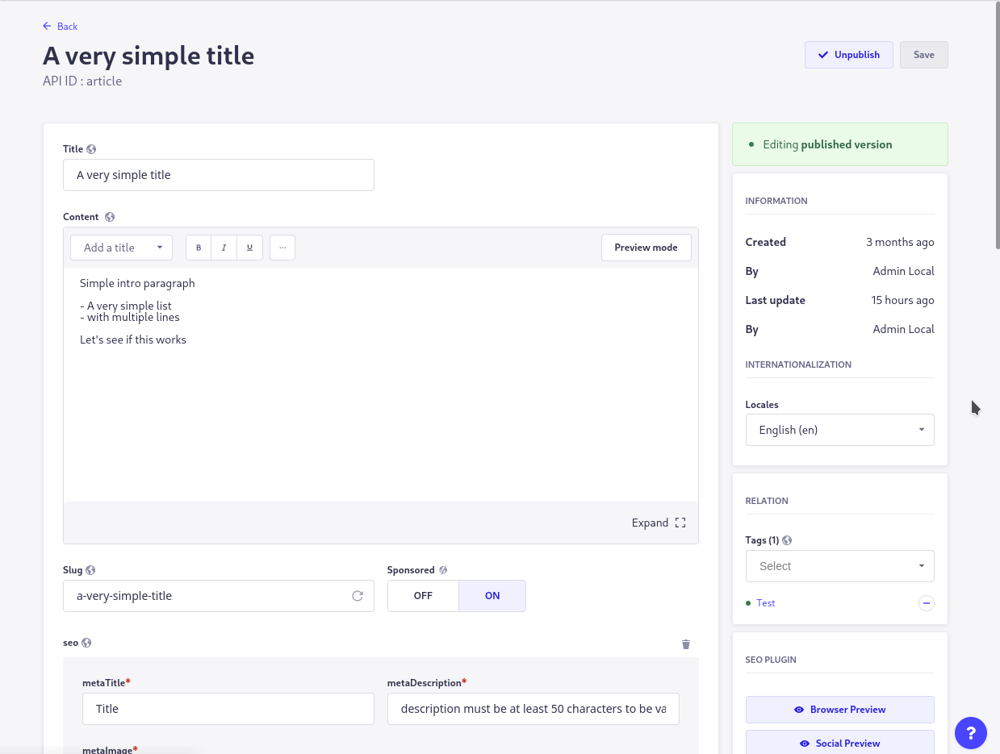

<p align="center">
  
</p>

# Strapi plugin DeepL

> This plugin is still a work in progress

This plugin integrates strapi with the [DeepL-API](https://www.deepl.com/pro-api) to provide quick automated translation of content fields.



## Requirements

This plugin requires the following, in order to work correctly:
- The plugin **i18n** installed and enabled (`@strapi/plugin-i18n` [[npm](https://www.npmjs.com/package/@strapi/plugin-i18n)])
- The content type to have internationalization enabled (advanced settings in the content type builder)
- In the internationalization settings at least **two** locales
- In the config an apiKey defined (see [Setup](#setup))

Unless you have the previous not set up, the field on the right where you can translate will not show up. Also it will not show up when editing the currently only available translation of an 

## Setup

> Configuration is currently only possible using the plugin config file `config[/env]/plugins.js` or environment variables

```js
module.exports = {
  // ...
  deepl: {
    enabled: true,
    config: {
      // your DeepL API key
      apiKey: 'key',
      // whether to use the free or paid api, default true
      freeApi: true,
      // Which field types are translated (default string, text, richtext, components and dynamiczones)
      translatedFieldTypes: [
        'string',
        'text',
        'richtext',
        'component',
        'dynamiczone',
      ],
      // You can define a custom glossary to be used here (see https://www.deepl.com/docs-api/managing-glossaries/)
      glossaryId: 'customGlossary',
    },
  },
  // ...
}
```

or using the default environment variables:

- `DEEPL_API_KEY` - default `null`
- `DEEPL_API_FREE` - default `true`

To get an API key, register for free at [www.deepl.com/pro#developer](https://www.deepl.com/pro#developer).

## Features

- fill in and translate any locale from another already defined locale
- Configure which field types are translated
  - standard text fields and nested components by default
  - The translation of Markdown using DeepL works relatively well but is not perfect. Watch out especially if you have links in Markdown that could be changed by translation
  - **uid fields are not translated** by default because they might not result in the same translation as the attached field -> saving is prevented in the conent manager anyway until you change the slug again
- Fields that are marked as not translated in the content-type settings will not be translated
- Translation of relations by the followig schema:\
  (_The related objects are not translated directly, only the relation itself is translated_)
  - the related content type **is localized**:
    - if a localization of the relation with the targetLocale exists\
      -> it is used
    - else the relation is removed
  - the related content type **is not localized**:
    - the relation goes both ways and would be removed from another object or localization if it was used (the case with oneToOne or oneToMany)\
      -> it is removed
    - otherwise the relation is kept

## (Current) Limitations:

- Only the [deepl supported languages](https://www.deepl.com/docs-api/translating-text/request/) can be translated
- Only up to 50 text fields can be translated at once


## TODOs

- [x] Ignore fields that are not translated
- [x] Ignore dates, enumeration, email, json
- [x] Allow translation of nested data
  - [x] components
  - [x] dynamic zones
- [ ] Configuration of free Api and token also through admin
- [ ] Overview of api usage in admin panel -> api done
- [ ] batch translation (needs to also 'translate' uids)
- [x] translate relations as well
- [ ] Tests
  - [ ] unit (partly done, controllers missing)
  - [ ] e2e

## Legal Disclaimer

Feki.de e.V. do not hold the copyright to the Logos of Strapi Inc. or DeepL SE. There is no cooperation or any other sort of affiliation between Feki.de e.V. and Strapi Inc. or DeepL SE. The Logos are used under fair use in order to not confuse Users as to what this plugin does.
